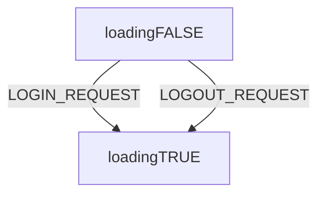
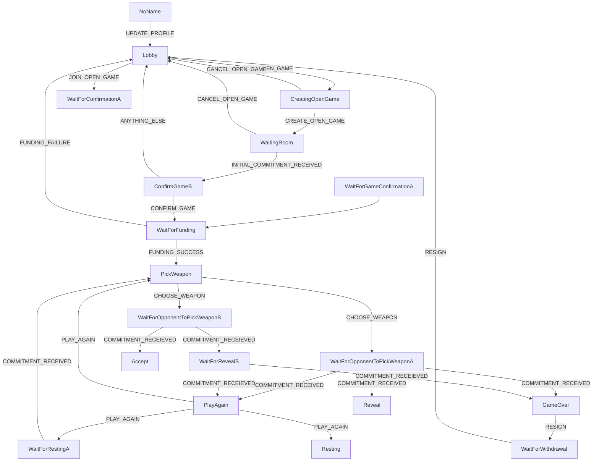

<!-- Recommend VSCode plugin 
Name: Markdown Preview Mermaid Support
Id: bierner.markdown-mermaid
Description: Adds Mermaid diagram and flowchart support to VS Code's builtin markdown preview
Version: 1.1.2
Publisher: Matt Bierner
VS Marketplace Link: https://marketplace.visualstudio.com/items?itemName=bierner.markdown-mermaid -->
# Redux diagrams (current state)
as of commit 1947c682f74648ee162459314827bb9e24ca1fb1
### Methodology
These flowcharts are made by constructing nodes from the *state types* or (*stage types* where indicated), from the relevant file in a `/states/` directory, and then constructing edges from the relationships defined in the relevant `/reducers/` directory. Edges are labelled with the *action types* from the `/actions/` directory (or function calls such as other reducers), and the flowcharts suppress information about conditional checks that are performed by the reducers. Where useful, reducers have had their sub-reducers unpacked -- making for a fewer number of more complicated flowcharts. When a reducer returns the same state as the result of conditional checks failing, these loops are also suppressed. Globally handled actions are also sometimes suppressed.
<!-- TODO: consider using the actual `string` value of the types, rather than the variable name. -->
<!-- TODO: related to ^, consider enforcing this string to be *exactly* the same as the type variable name -->
<!-- TODO: use hyperlinks / anchors to make this document easier to navigate. -->


### Key: 
```mermaid
  graph LR
  linkStyle default interpolate basis
    STATE --> |ACTION| ANOTHER_STATE
    ANOTHER_STATE.->|functionCall| YET_ANOTHER_STATE
```
# Top level
## loginReducer
[`/packages/rps/src/redux/login/reducer.ts`](../src/redux/login/reducer.ts)

<!-- etc -- doesn't fit in a flowchart so nicely. -->
## gameReducer
[`/packages/rps/src/redux/game/reducer.ts`](../src/redux/game/reducer.ts)
