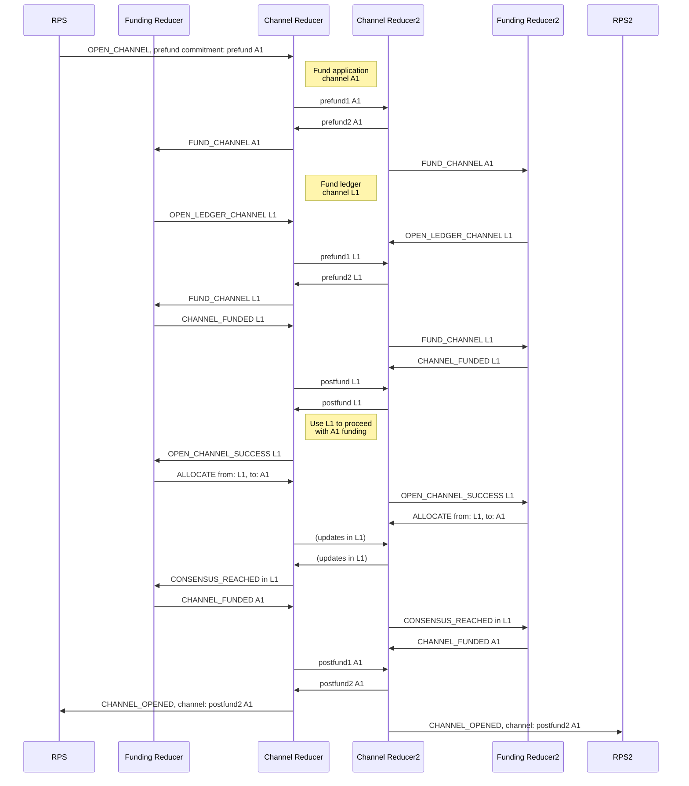

# Channel opening sequence

```mermaid
sequenceDiagram
    participant R1 as RPS
    participant F1 as Funding Reducer
    participant C1 as Channel Reducer
    participant C2 as Channel Reducer2
    participant F2 as Funding Reducer2
    participant R2 as RPS2

    R1->>C1: OPEN_CHANNEL, prefund commitment: prefund A1

    Note right of C1: Fund application <br> channel A1
    C1->>C2: prefund1 A1
    C2->>C1: prefund2 A1
    C1->>F1: FUND_CHANNEL A1
    C2->>F2: FUND_CHANNEL A1

    Note right of C1: Fund ledger <br> channel L1
    F1->>C1: OPEN_LEDGER_CHANNEL L1
    F2->>C2: OPEN_LEDGER_CHANNEL L1
    C1->>C2: prefund1 L1
    C2->>C1: prefund2 L1
    C1->>F1: FUND_CHANNEL L1
    F1->>C1: CHANNEL_FUNDED L1
    C2->>F2: FUND_CHANNEL L1
    F2->>C2: CHANNEL_FUNDED L1
    C1->>C2: postfund L1
    C2->>C1: postfund L1

    Note right of C1: Use L1 to proceed <br> with A1 funding
    C1->>F1: OPEN_CHANNEL_SUCCESS L1
    F1->>C1: ALLOCATE from: L1, to: A1
    C2->>F2: OPEN_CHANNEL_SUCCESS L1
    F2->>C2: ALLOCATE from: L1, to: A1
    C1->>C2: (updates in L1)
    C2->>C1: (updates in L1)
    C1->>F1: CONSENSUS_REACHED in L1
    F1->>C1: CHANNEL_FUNDED A1
    C2->>F2: CONSENSUS_REACHED in L1
    F2->>C2: CHANNEL_FUNDED A1
    C1->>C2: postfund1 A1
    C2->>C1: postfund2 A1
    C1->>R1: CHANNEL_OPENED, channel: postfund2 A1
    C2->>R2: CHANNEL_OPENED, channel: postfund2 A1

```
