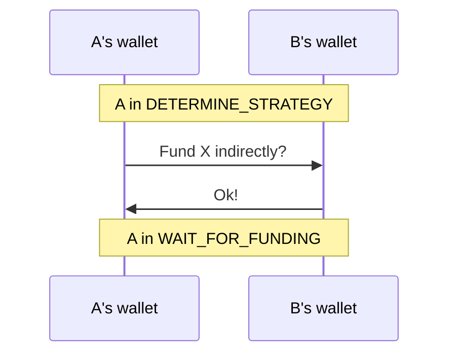
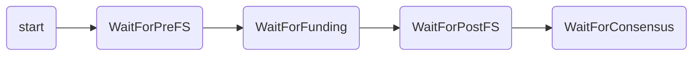
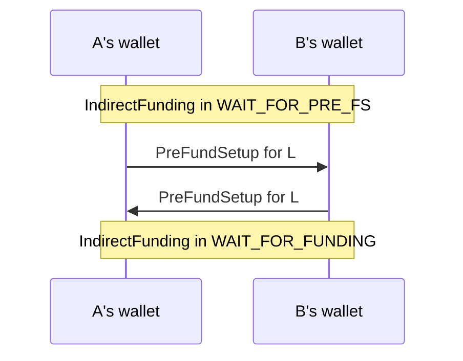
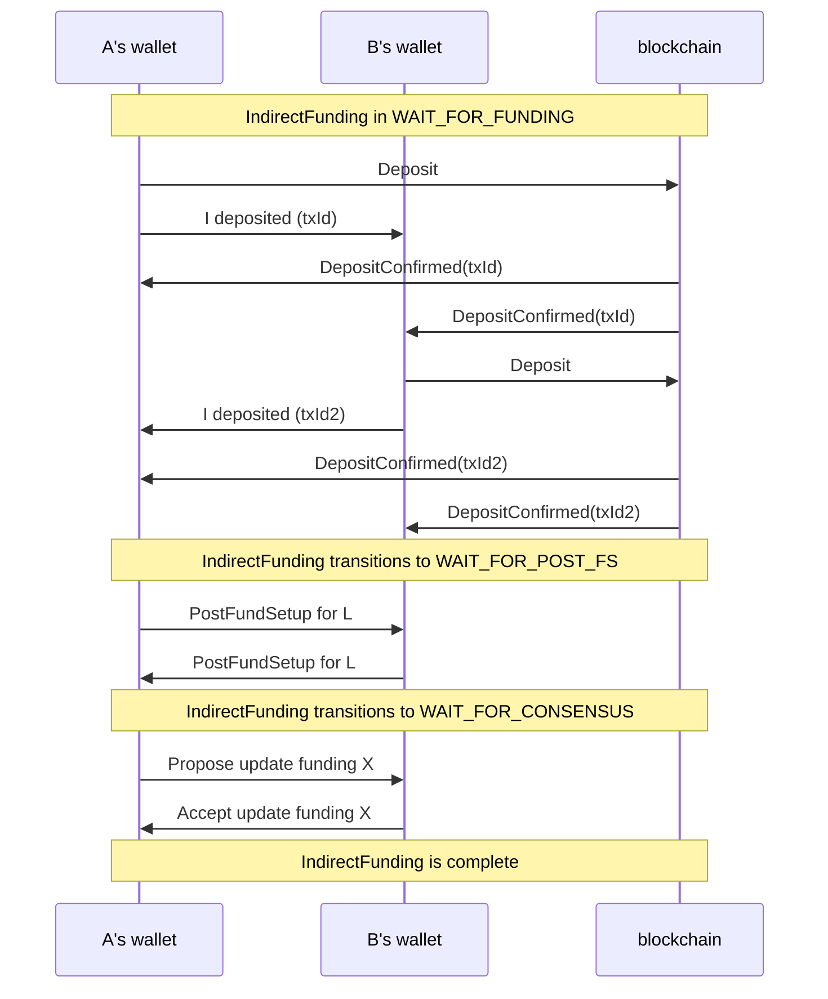

# Indirect Funding - Design Proposal

## Goal

The goal of this proposal is to sketch out a possible approach to funding an application channel, A, via a ledger channel, L. 
It is deliberately high-level and hand-wavy, designed to start a discussion rather than finish one.


## Out of Scope

* Running the full funding algorithm
  * Instead we'll assume the simple case of one app channel A, funded by a directly-funded ledger channel L.
* Storing the funding table / funding relationships
  * We'll just focus on opening an L that funds A, without worrying about how to remember that A is funded by L.


## Proposed Operation

We start in a position where both parties are at the funding point and have approved funding for application channel X. The channel state is in a new `DETERMINE_STRATEGY` state:
```json
{
  channels: { X: { channelId: X, state: DETERMINE_STRATEGY, ... } },
}
```
The following interaction then occurs:

After this the wallet state updates as follows:
```json
{
  channels: { X: { channelId: X, state: WAIT_FOR_FUNDING, strategy: 'indirect', ... } },
  indirectFundings: { X: { id: X, state: START } },
}
```
Note: from the information stored in channel X, you have enough to locate the appropriate `indirectFunding`.
This can be used by the channel container do figure out what to display.

The indirectFunding state is a state machine with (something like) the following states:

This state machine drives the creation of the ledger channel and generation of its states - 
analogous to how the RPS app drives the creation of a RPS channel and the generation of its states.

Suppose the following interactions then occur:



When the indirectFunding is in the `WAIT_FOR_FUNDING` state, the wallet state will look something like:
```json
{
  channels: {
    X: { channelId: X, state: WAIT_FOR_FUNDING, strategy: 'indirect', ... },
    L: { channelId: L, state: WAIT_FOR_FUNDING, strategy: 'direct', ... }
   },
  indirectFundings: {
    X: { id: X, ledgerChannelId: L, state: WAIT_FOR_FUNDING,  strategy: 'direct', .. }
  },
  directFundings: {
    L: { id: L, state: WAIT_FOR_SAFE_DEPLOY, .. }
  }
}
```
Note: like before, the info in the `indirectFunding` record can be used to find the corresponding `directFunding`.

The `directFunding` state tracks the direct funding state machine as found currently in the codebase.

The interaction proceeds as follows:


At this point, we've opened an L that funds A. The wallet state might look something like:
```json
{
  channels: {
    X: { channelId: X, state: RUNNING, funding: 10, ... },
    L: { channelId: L, state: RUNNING, funding: 20, }
   },
  indirectFundings: { },
  directFundings: { },
  // [tbd, out of scope] some way of recording that L funds X
}
```

## Notes/caveats

1. The state format here is just one choice of many. I was trying to go reasonably close to what we have already.
2. This doesn't say how to structure the code but it would fit well with the actions-first reducers already discussed.
