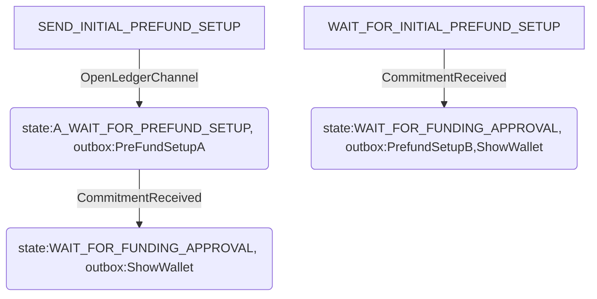

```mermaid
graph TD
SEND_INITIAL_PREFUND_SETUP-->|OpenLedgerChannel|WAIT_FOR_PREFUND_SETUP(state:A_WAIT_FOR_PREFUND_SETUP, outbox:PreFundSetupA)
WAIT_FOR_PREFUND_SETUP-->|CommitmentReceived|WAIT_FOR_FUNDING_APPROVAL_FROM_A(state:WAIT_FOR_FUNDING_APPROVAL, outbox:ShowWallet)
WAIT_FOR_INITIAL_PREFUND_SETUP-->|CommitmentReceived|WAIT_FOR_FUNDING_APPROVAL_FROM_B(state:WAIT_FOR_FUNDING_APPROVAL, outbox:PrefundSetupB,ShowWallet)
```
