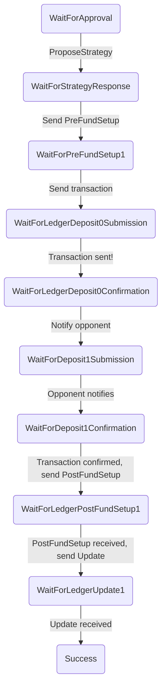

# Indirect Funding

The indirect funding module coordinates the process of funding an application channel via a ledger channel.

## How do actions get routed to the indirect funding module?

We the `process` property added to actions to decide which actions to route to the indirect funding. For example, the following action will be processed by the indirect funding module:

```js
{
  type: 'ledger-updated',
  process: 'indirect-funding',
  channelId: 'abc123'
}
```

In order for this to work the following things must happen:

- Wallet messages sent to an opponent must include the `process` and `channelID` information, so that they can be correctly routed on receipt.
- Transactions sent to the `TransactionSender` must also include the `process` and `channelId`, so that the `TransactionSender` can include these properties on the `TransactionSubmitted` and `TransactionConfirmed` events.
- Any actions triggered from the UI during the indirect funding process must include the `process` property.

The `indirect-funding` module takes top priority for actions marked for it: these actions are always sent to the indirect funding reducer and they are not then sent anywhere else.

## What is the signature of the indirect-funding reducer?

For the time being, the indirect-funding reducer will accept a _wallet state_ and return a _wallet state_:

```ts
function indirectFundingReducer(state: WalletState, action: IndirectFundingAction): WalletState {
  // ...
}
```

The reducer acts on the entire state.

## How does the indirectFundingReducer handle actions?

The indirect funding process is not symmetric: the states you pass through depend if you are player A (the first player in the outcome at the time of funding) or player B. We model this by having a separate state machine for each player.

When handling actions, the `indirectFundingReducer` does the following:

1. Look up the current state of the funding process corresponding to the `channelId` in the action.
2. Determine from this state whether we are Player A or Player B.
3. Delegate to the reducer for player A or B as appropriate.

The player A and player B reducers encode the state transitions for their respective state machines. For example, player A's state machine is as follows:



## What about re-using our existing direct funding code?

I think that, for the time being, we should just duplicate the direct funding code inside the indirect funding. It should be easy to factor this out later and it avoids having to decide upfront what the interface should be between these two different processes.
