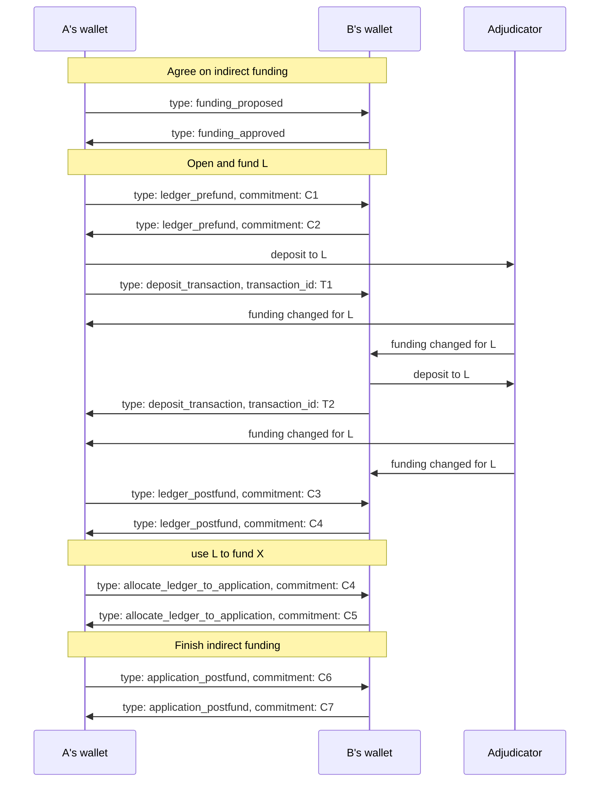

# Indirect funding sequence diagram

## Overview

The sequence diagram shows the interaction between `player A`, `player B` and the adjudicator/blockchain. The diagram does not attempt to describe internal events for either of the players or the adjudicator.

## Starting state

We assume that the application is responsible for driving the application channel to the point where the channel is ready for funding.

## Terminology

Below, we refer to the application channel as `X`. We refer to the ledger channel funding the application channel as `L`. `Player A` is the first player, or, in other words, the player who initiated opening the application channel. A `proccess` is a coordinated sequence of actions that achieves a high-level channel goal like indirectly funding a channel, topping up of a channel, etc.

## Diagram

For the diagram below, every exchanged message between `player A` and `player B` also contains the following key-value pairs:

1.  `process: indirect_funding`
2.  `channelId: X`

