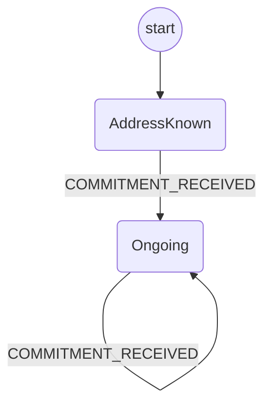

# Application Protocol

The purpose of this protocol is to manage the application's commitments.

It should be triggered by the `INITIALIZE_CHANNEL` event from the app.
This prepares an address to be used to sign application commitments.

It should never fail.

## Open questions

How does this process reach a terminal state?

## State machine

The protocol is implemented with the following state machine.
When in the `Ongoing` state, it is the application's responsibility to inform the wallet that

