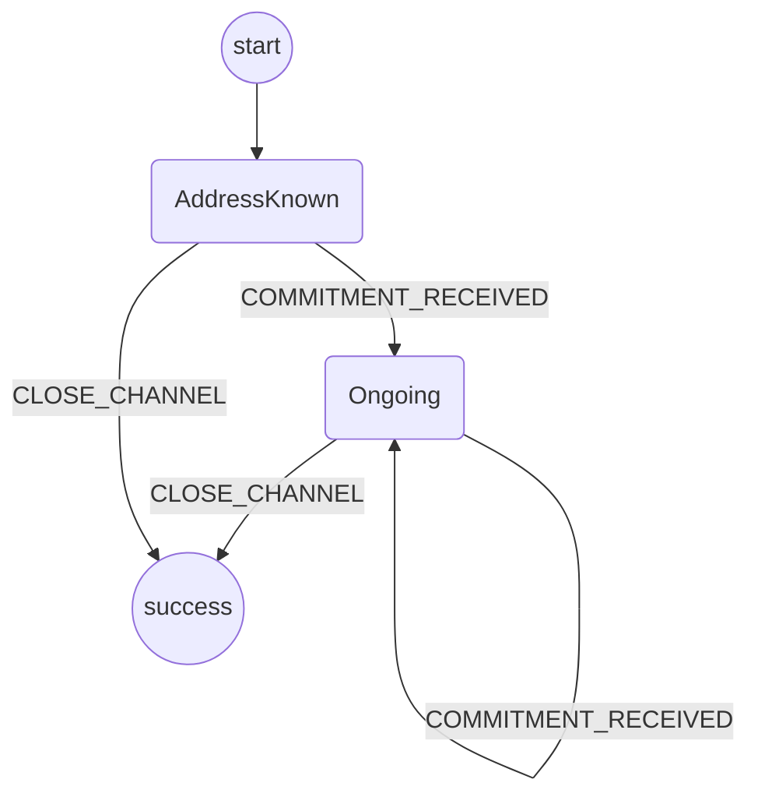

# Application Protocol

The purpose of this protocol is to manage the application's commitments.

It should be triggered by the `INITIALIZE_CHANNEL` event from the app.
This prepares an address to be used to sign application commitments.

It should never fail.

There should only ever be one application process running, so the processId is a fixed string.

## State machine

The protocol is implemented with the following state machine.

Notes:

- `COMMITMENT_RECEIVED` is shorthand for either `OWN_COMMITMENT_RECEIVED` or `OPPONENT_COMMITMENT_RECEIVED`
- `CLOSE_CHANNEL` gets issued when the user has requested to conclude the game. From that point on we refuse anymore commitments from the application. Conclude commitments will be handled by the wallet.
