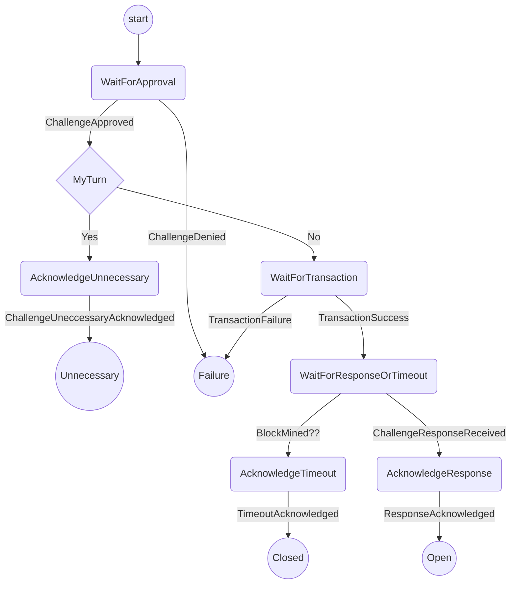

# Challenging Protocol

This protocol handles launching a challenge on the blockchain. It includes:

- Getting confirmation from the user to launch the challenge.
- Submitting the challenge transaction to the blockchain.
- Monitoring the blockchain for a response or timeout.

Out of scope (for now)

- Halting the challenge in the case where the opponents move arrives between approval and transaction submission.

## State machine

The protocol is implemented with the following state machine

Note:

- We don't currently give the option to retry in the case that the transaction fails.
- The `MyTurn` check is performed after approval, just in case the opponent's move has arrived in the meantime.
