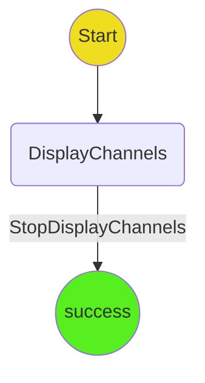

# Channel Management Protocol

The channel management protocol is a simple protocol that allows users to manage their ledger channels with the hub.

The user should be able to close channels with the hub and withdraw their funds.

## State Machine

