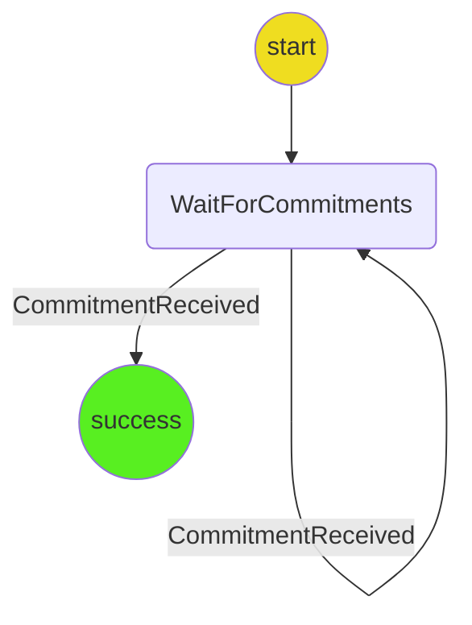

# Channel Sync Protocol

The purpose of this protocol is to synchronize commitments between all players, so all players have the latest commitment.

Each player broadcasts all the commitments they have for a channel. Each player will then update their commitments to the latest valid commitment.

## Out of scope

- Initializing a channel if it does not exist for a player.
- Reconciling alternative commitments. We're going to assume that there are no alternative moves to deal with and the only scenario is where some players are one or more commitments behind another.

