# Concluding

The concluding protocols coordinate the process of concluding a channel.

## Currently Out of Scope

- Getting user approval. This should be revisited when we think about approval system wide.
- Concluding out of turn. Currently we only allow a user to initate a conclude on their turn.

## State Machine

```mermaid
graph TD
linkStyle default interpolate basis
  St((start))-->WFC(WaitForConclude)
  WFC-->|AdvanceChannelAction|WFC
  WFC-->|AdvanceChannelSuccess|WFD(WaitForDefund)
  WFD-->|DefundAction|WFD
  WFD-->|DefundSuccess|D{Close?}
  D-->|No|S((success))
  D-->|Yes|WFLC(WaitForLedgerChannelClose)
  WFLC-->|CloseAction|WFLC
  WFLC-->|CloseSuccess|S


  classDef logic fill:#efdd20;
  classDef Success fill:#58ef21;
  classDef Failure fill:#f45941;
  classDef WaitForChildProtocol stroke:#333,stroke-width:4px,color:#ffff,fill:#333;
  class St,D logic;
  class S Success;
  class F Failure;
  class WFC,WFS,WFD,WFLC WaitForChildProtocol
```

