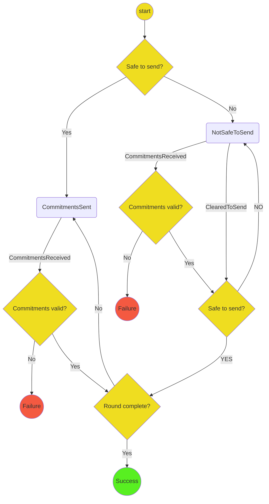

# Consensus Update Protocol

The purpose of the protocol is to handle updating the allocation and destination of channels running the consensus app.

## State Machine

```mermaid
graph TD
linkStyle default interpolate basis
  St((start)) --> STSCO{Safe to send?}
  STSCO --> |Yes| CS
  STSCO --> |No| NSTS(NotSafeToSend)
  NSTS -->|CommitmentsReceived| CV2{Commitments valid?}
  CV2   -->|No| F((Failure))
  CV2 -->|Yes| STS{Safe to send?}
  NSTS -->|ClearedToSend| STS

  CS   -->|CommitmentsReceived| CV{Commitments valid?}
  STS -->|YES| RC
  STS -->|NO| NSTS
  CV   -->|No| F2((Failure))
  CV   -->|Yes| RC{Round complete?}

  RC   -->|No| CS(CommitmentsSent)
  RC   -->|Yes| S((Success))

  classDef logic fill:#efdd20;
  classDef Success fill:#58ef21;
  classDef Failure fill:#f45941;

  class St,STS,STSCO,FP,RC,CV,CV2 logic;
  class S Success;
  class F,F2 Failure;
```
