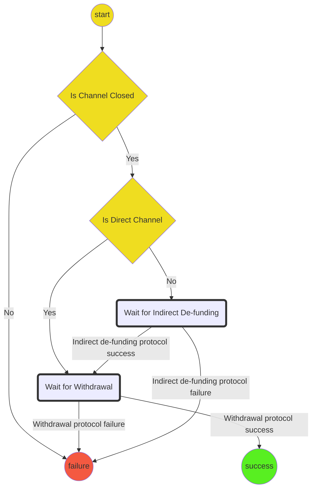
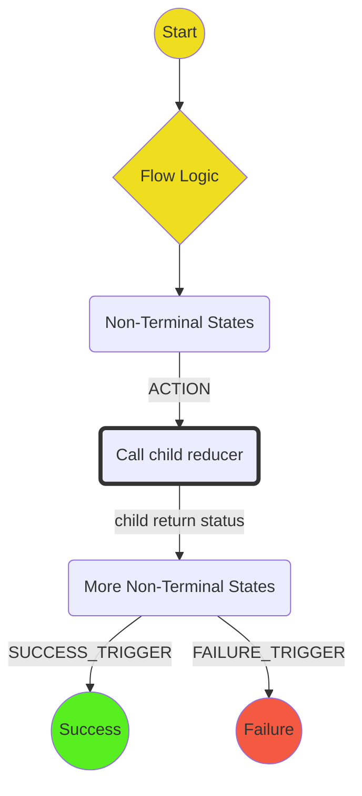

# De-Funding Protocol

This protocol handles de-funding a channel. It includes:

- Checking to see that a channel is finalized (either concluded or finalized on chain)
- If a direct channel, initiates the withdrawal protocol.
- Monitoring the blockchain for a response or timeout.

## State machine

The protocol is implemented with the following state machine

Key:

## Notes

- Withdrawal Complete/Failure and Indirect de-funding Complete/Failure are not actions. They are checks on the sub-protocol state to see if success/failure has been reached.

## Scenarios

1. **Directly Funded Channel Happy Path** - Start -> Is Channel Closed -> Yes-> Is Direct Channel -> Yes -> Wait for Withdrawal->Withdrawal Protocol Complete -> Success
2. **Indirect Funded Channel Happy Path** - Start -> Is Channel Closed -> Yes-> Is Direct Channel -> No -> Wait for Indirect de-funding -> Indirect de-funding Protocol Complete -> Wait for Withdrawal->Withdrawal Protocol Complete -> Success
3. **Channel Not Closed** - Start -> Is Channel Closed -> No -> Failure
4. **Withdrawal Failure** - Start -> Is Channel Closed -> Yes -> Is Direct Channel -> Yes -> Wait for Withdrawal-> Withdrawal Protocol Failure -> Failure
5. **Indirect de-funding Failure** - Start -> Is Channel Closed -> Yes-> Is Direct Channel -> No ->Wait for Indirect de-funding->Indirect de-funding Protocol Failure -> Failure
