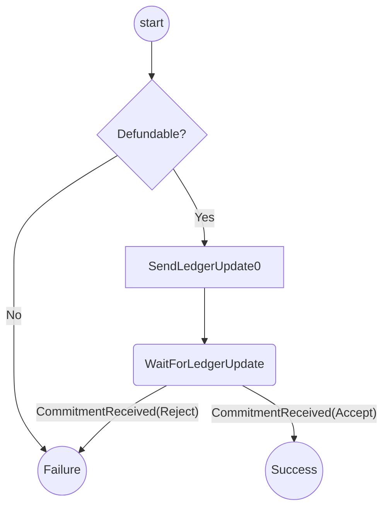
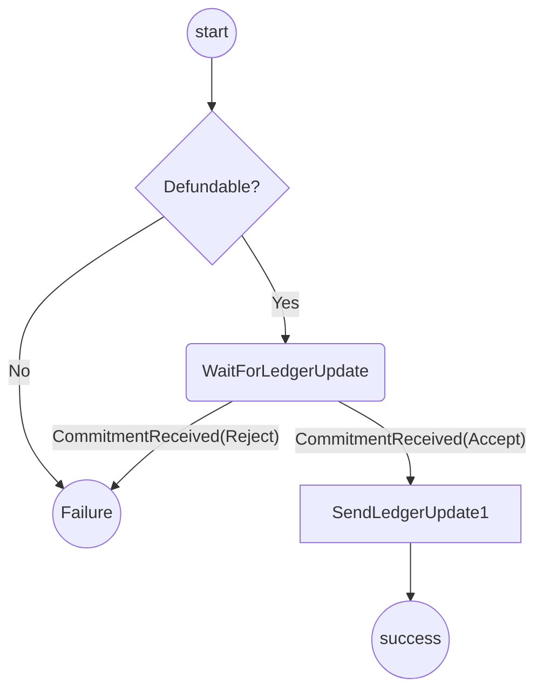

# Indirect De-Funding Protocol

The purpose of this protocol is handle de-funding a channel that has been indirectly funded.

It covers:

- Checking that a channel is closed (either finalized on chain or a conclusion proof exists)
- Crafting a ledger update that allocates the funds to the players.
- Waiting for a ledger response from the opponent.

## State machine

### Player A State machine

### Player B State machine

Notes:

- SendLedgerUpdate0/1 are not states but indicate when the ledger update is sent.
- A single reducer implements both the player A and B state machine.
