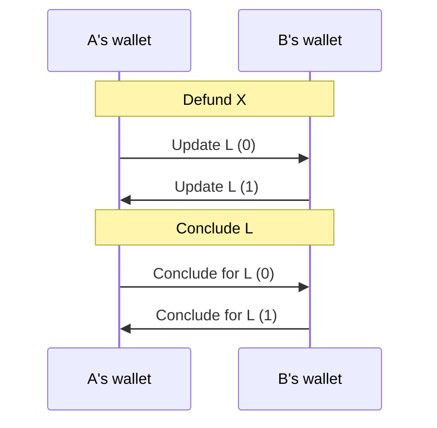

# Indirect De-Funding Protocol

The purpose of this protocol is handle de-funding a channel that has been indirectly funded.

The protocol exchanges updates to allocate funds back to the player and conclude commitments to close the channel.

It covers:

- Checking that a channel is closed (either finalized on chain or a conclusion proof exists)
- Crafting a ledger update that allocates the funds to the players.
- Waiting for a ledger response from the opponent, and offering the option to challenge if they are unresponsive.
- Crafting a conclude commitment to close the ledger channel.
- Allowing the ledger channel to be finalized via an expired challenge



## State machine

```mermaid
graph TD
linkStyle default interpolate basis
  St(( ))-->DF{Defundable?}
  DF --> |No| F(( ))
  DF --> |Yes, Player A| CLU(ConfirmLedgerUpdate)
  DF --> |Yes, Player B| WLU(WaitForLedgerUpdate)

  CLU-->|UPDATE_CONFIRMED|WLU
  CLU-->|UPDATE_CONFIRMED|ALFon(AcknowledgeLedgerFinalizedOffChain)
  CLU.->|CHALLENGE_DETECTED|W4DR(WaitForDispute.Responder)

  WLU-->|COMMITMENT_RECEIVED|CLU
  WLU.->|CHALLENGE_CHOSEN|W4DC(WaitForDispute.Challenger)
  WLU-->|COMMITMENT_RECEIVED|ALFon

  W4DC.->|Open|CLU
  W4DC.->|Open|ALFon
  W4DC.->|TxFailed|W4DC
  W4DC.->|Closed|ALFoff(AcknowledgeLedgeFinalizedOffChain)

  W4DR.->|Success|WLU
  W4DR.->|Success|ALFon
  W4DR.->|Closed|ALFoff
  W4DR.->|TxFailed|W4DR

  ALFoff-->|ACKNOWLEDGED|Soff((SuccessOff))
  ALFon-->|ACKNOWLEDGED|Son((SuccessOn))

  classDef logic fill:#efdd20;
  classDef Success fill:#58ef21;
  classDef Failure fill:#f45941;
  classDef WaitForChildProtocol stroke:#333,stroke-width:4px,color:#ffff,fill:#333;

  class St,DF logic;
  class Soff,Son Success;
  class F Failure;
  class W4DR,W4DC WaitForChildProtocol;
```

## Scenarios

1. **Happy Path - Player A**
   - Start
   - ConfirmLedgerUpdate + UPDATE_CONFIRMED
   - WaitForLedgerUpdate + COMMITMENT_RECEIVED (consensus game update)
   - ConfirmLedgerUpdate + UPDATE_CONFIRMED
   - WaitForLedgerUpdate + COMMITMENT_RECEIVED (conclude)
   - AcknowledgeLedgerFinalized
2. **Happy Path - Player B**
   - Start
   - WaitForLedgerUpdate + COMMITMENT_RECEIVED (consensus game update)
   - ConfirmLedgerUpdate + UPDATE_CONFIRMED
   - WaitForLedgerUpdate + COMMITMENT_RECEIVED (conclude)
   - ConfirmLedgerUpdate + UPDATE_CONFIRMED
   - AcknowledgeLedgerFinalized
3. **Not De-fundable**
   - Start
   - Failure
4. **Player A: A ForceMoved by B, A Responds**
   - ConfirmLedgerUpdate + CHALLENGE_DETECTED
   - WaitForDisputeResponder + Success
   - WaitForLedgerUpdate
5. **Player B: A ForceMoved by B, A Responds**
   - WaitForLedgerUpdate + CHALLENGE_CHOSEN
   - WaitForDisputeChallenger + Open
   - ConfirmLedgerUpdate
6. **Player A: A ForceMoved by B, Expires**
   - ConfirmLedgerUpdate + CHALLENGE_DETECTED
   - WaitForDisputeResponder + Closed
   - AcknowledgeLedgerFinalized
7. **Player B: A ForceMoved by B, Expires**
   - WaitForLedgerUpdate + CHALLENGE_CHOSEN
   - WaitForDisputeChallenger + Closed
   - ConfirmLedgerUpdate
