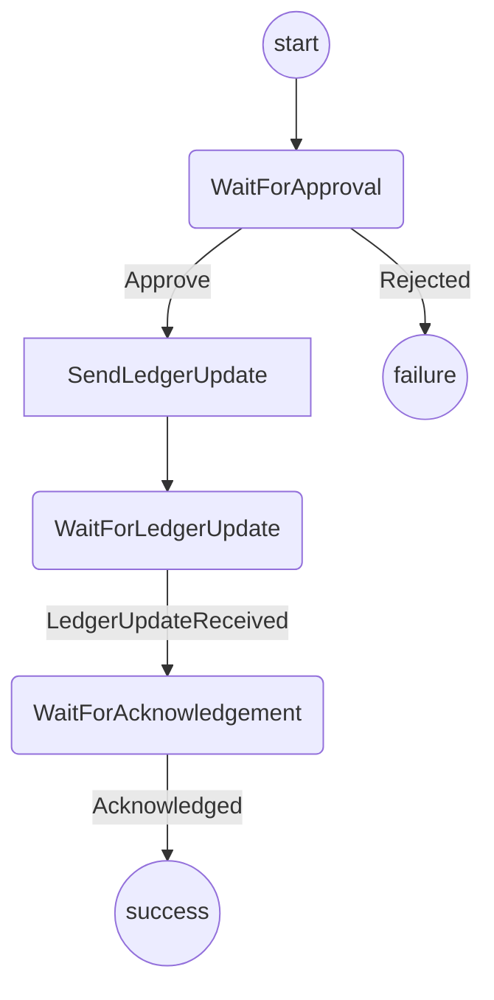
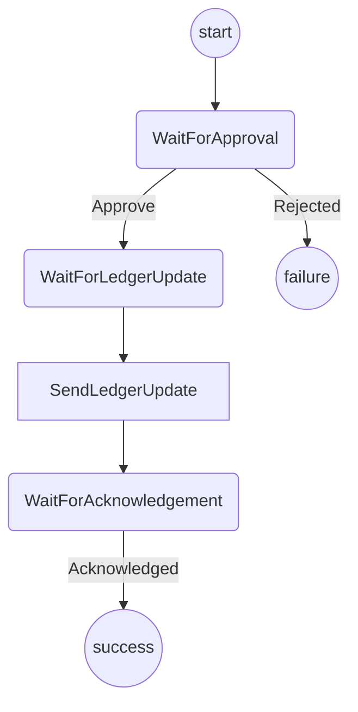

# Indirect De-Funding Protocol

The purpose of this protocol is handle de-funding a channel that has been indirectly funded.

It covers:

- Checking that a channel is closed (either finalized on chain or a conclusion proof exists)
- Crafting a ledger update that allocates the funds to the players.
- Waiting for a ledger response from the opponent.

## State machine

### Player A State machine

### Player B State machine

Notes:

- Currently doesn't handle the case where one player approves, one player declines

## Open Questions

1. Is this a top-level protocol? If so what closes the channel?
2. Can we rely on this being performed co-operatively?
