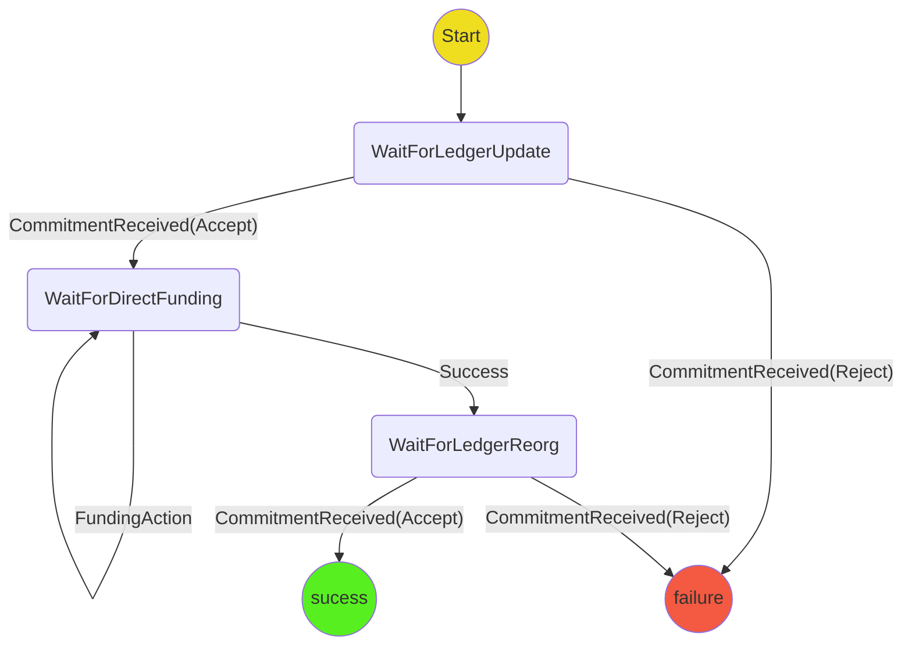

# Ledger Top Up Protocol

The purpose of the protocol is to top up an existing ledger channel so that it can be used to fund a game.
The protocol has three main steps:

- The protocol exchanges ledger updates that have the additional top-ups at the end of the allocation array.
- The protocol initiates the direct funding protocol to fund the additional top ups
- The protocol exchanges ledger update with simplified allocations

## State machine

## Scenarios
