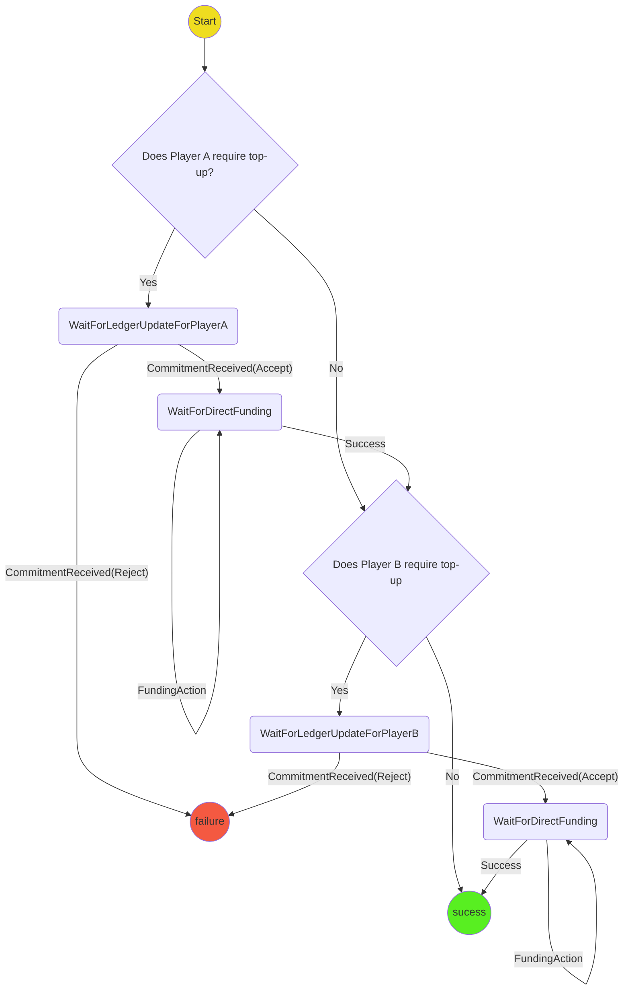

# Ledger Top Up Protocol

The purpose of the protocol is to top up an existing ledger channel so that it can be used to fund a game.

## State machine

## Scenarios

1. **Both Players need top-up** Start->WaitForLedgerUpdatePlayerA->WaitForDirectFunding->WaitForLedgerUpdatePlayerB-->WaitForDirectFunding->Success
2. **Only Player A needs top-up** Start->WaitForLedgerUpdatePlayerA->WaitForDirectFunding->Success
3. **Only Player B needs top-up** Start->WaitForLedgerUpdatePlayerB->WaitForDirectFunding->Success
4. **No players need top-up** Start-->Success
5. **Player A Ledger Update Rejected** WaitForLedgerUpdatePlayerA-->Failure
6. **Player B Ledger Reorg Rejected** WaitForLedgerUpdatePlayerB->Failure
