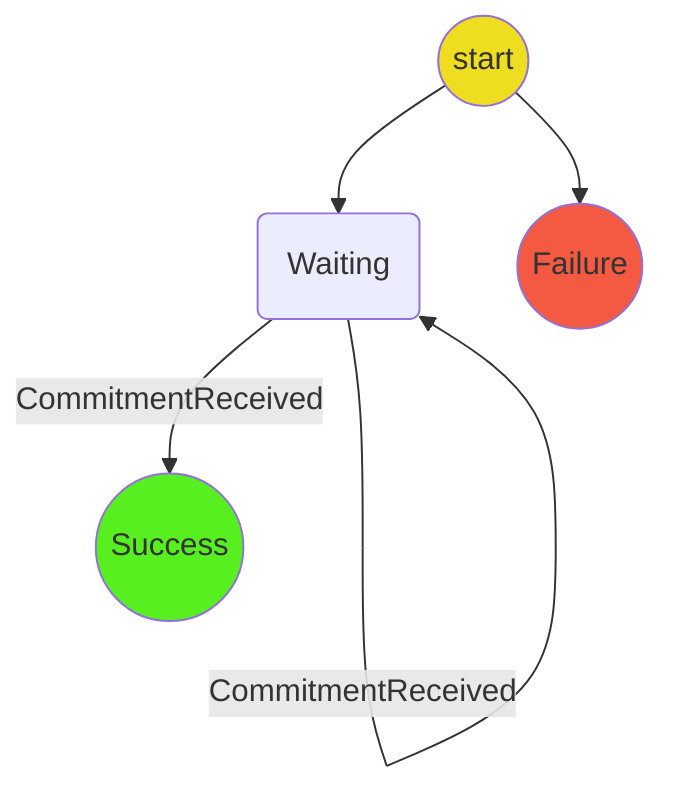
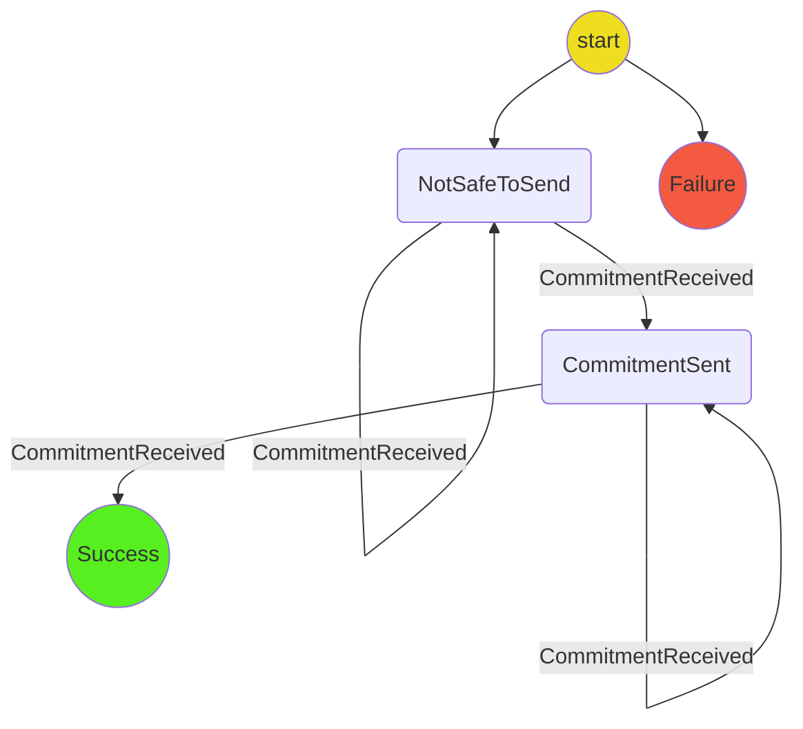

### Preparing a channel

The PrepareChannel protocol accepts four mandatory inputs and one optional input:

- `channelId`
- `appAttributes`
- `targetTurnNum`
- `commitmentType`
- `startingOpts?`: the data needed to construct the first commitment

It returns success when a state channel has been progressed to a desired turn number.

It can be used in any stage where the application attributes cannot change -- in other words, any stage other than the application stage.

When the channel does not exist, it writes a new channel to storage. When the channel does exist, it updates its latest commitments in storage in the following two cases:

1. When it is safe to send the next commitment
2. When the target `turnNum` has been reached

It is safe to send the next commitment when

1. A valid round of commitments is received.
2. The target `turnNum` has not yet been reached

A round of commitments is valid if either of the following conditions hold

- The first commitment is the latest stored commitment, each transition is valid, and there are `participants.length` commitment.
- The first commitment has `turnNum == 0`, each transition is valid, and it is now the participant's turn.

When it is safe to send the next commitment, the protocol

1. Crafts the next commitment
2. Stores the latest round of commitments in storage
3. Sends the latest round of commitments to the next participant in the channel

When a commitment is received, and the target `turnNum` has been reached, the protocol

1. Stores the latest round of commitments in storage
2. Returns success

If the parameters passed to `initialize` are invalid, then it moves directly to `Failure`.
This can happen, for example, if the channel would be required to move from an `Application` stage commitment to another `Application` stage commitment in order to reach the target turn number. It can also happen if there are no valid transitions to a commitment of type `commitmentType` from the latest commitment of the channel.

## Decisions

- To simplify the communication assumptions in a channel with an arbitrary number of participants, each participant sends a full round of commitments only to the next participant.

## Open questions

Which of the following should we do? (1) is more flexible, (2) is simpler and more explicitly defined.

1. The protocol could calculate the correct `CommitmentType` for the next commitment. This is used when progressing a channel directly from turn 0 to the application phase, as might be done when constructing a virtual channel.
2. It could also be used to progress the channel exactly one round, eg. through the `PreFundSetup` phase, or through the `PostFundSetup` phase, or through the `Conclude` phase.

## State machine diagram

Diagram for approach 1. In this case, you might send a commitment but still have to wait.

Diagram for approach 2

