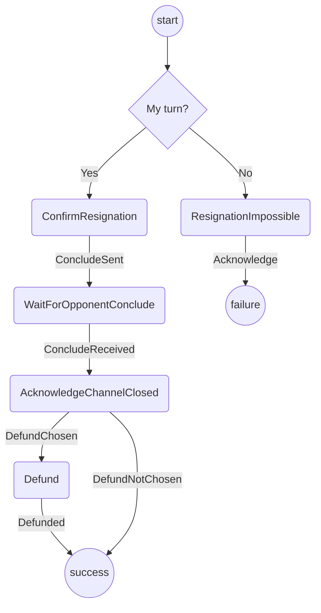

# Resignation Protocol

The purpose of this protocol is to resign a channel, i.e. to move to a conclude state.
It covers:

- Checking to see if it is the player's turn and explaining they can't resign if not
- Asking user to confirm the resignation (probably displaying the current outcome)
- Formulating the conclude state and sending to the opponent
- Waiting for a conclude from the opponent
- Acknowledge channel closed (giving the option to defund)

Out of scope (for the time being):

- Giving the option to launch a challenge if the conclude doesn't arrive

## State machine

The protocol is implemented with the following state machine

## Scenarios

To test all paths through the state machine we will use 3 different scenarios:

1. **Happy path**: `Start` -> `ConfirmResignation` -> `WaitForOpponentConclude` -> `AcknowledgeChannelClosed` -> `Defund` -> `Success`
2. **Resignation not possible**: `Start` -> `ResignationImpossible` -> `Failure`
3. **Closed but not defunded**: `AcknowledgeChannelClosed` -> `Success`

