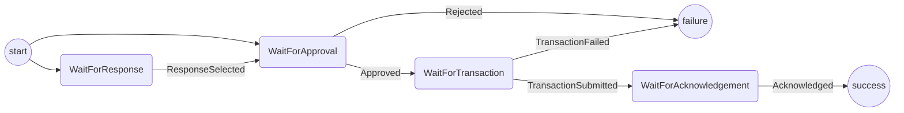

# Responding Protocol

The purpose of this protocol is handle responding to a challenge.
It covers:

- Deciding which options (respond/refute) are valid and presenting them to the user.
- Accepting a response commitment.
- Getting confirmation from the user to launch a response.
- Submitting the response transaction to the blockchain.
- Getting acknowledgement from the user before returning to app.

Out of scope (for the time being):

- Handling where the response commitment comes from.
- The respond with alternative move option.

## State machine

Notes:

- The protocols initialize function determines if it can provide a response with the existing commitments in channel state or if it needs a response.
