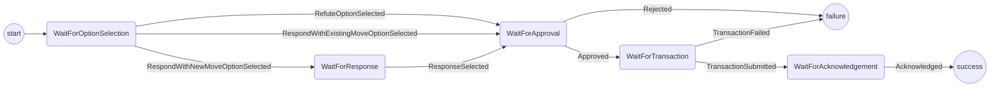

# Responding Protocol

The purpose of this protocol is handle responding to a challenge.
It covers:

- Deciding which options (respond/refute) are valid and presenting them to the user.
- Accepting a response commitment.
- Getting confirmation from the user to launch a response.
- Submitting the response transaction to the blockchain.
- Getting acknowledgement from the user before returning to app.

Out of scope (for the time being):

- Handling where the response commitment comes from.
- The respond with alternative move option.

## Open Questions

- For a ledger channel we don't want to ask the user to select an option. We should be able to handle deciding that in the wallet. How do we handle that?
  - Option 1: Allow the responding protocol to have two start points (WaitForOptionSelection or WaitForApproval)
  - Option 2: Separate responding into two different protocols. One that is responsible for submitting the provided response. One that is responsible for asking the user for a response.
  - Option 3: Always ask the user?

## State machine

The protocol is implemented with the following state machine

Notes:
