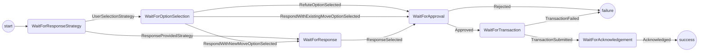
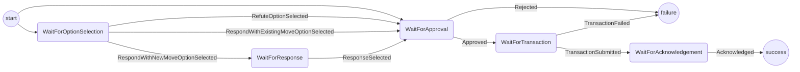
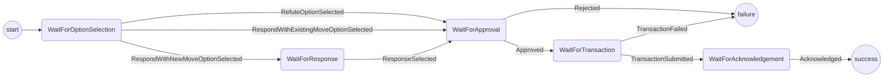

# Responding Protocol

The purpose of this protocol is handle responding to a challenge.
It covers:

- Deciding which options (respond/refute) are valid and presenting them to the user.
- Accepting a response commitment.
- Getting confirmation from the user to launch a response.
- Submitting the response transaction to the blockchain.
- Getting acknowledgement from the user before returning to app.

Out of scope (for the time being):

- Handling where the response commitment comes from.
- The respond with alternative move option.

## Open Questions

- For a ledger channel we don't want to ask the user to select an option. We should be able to handle deciding that in the wallet. How do we handle that in the response protocol?
  - Option 1: The responding protocol has another state (WaitForResponseStrategy) that determines if the user is asked to select an option.
  - Option 2: Allow the responding protocol to have two start points (WaitForOptionSelection or WaitForApproval)
  - Option 3: Separate responding into two different protocols. One that is responsible for submitting the provided response. One that is responsible for asking the user for a response.
  - Option 4: Always ask the user?
- Should we bother letting the user know there's a difference between `RespondWithExistingMove` and `Refute`? Only one of those options should be valid at a time (I think). We could just prevent the user with the option of selecting a move or having the Wallet auto respond.

## State machine (option 1)

## State machine (option 2)

## State machine (option 4)

