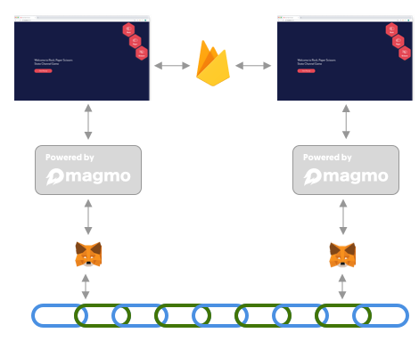

## What is the role of the magmo channel wallet?
 
The magmo channel wallet is a piece of software that assists communication between an application and the other player's application in a state channel. In the same way that metamask is an interface to the blockchain, the magmo channel wallet (sometimes known as 'statestash') is in some ways an interface to the state channel itself, and allows the application to conform to the ForceMove protocol (and shortly, the turbo and nitro protocols).

It is responsible for signing, verifying and storing states that *could* be submitted to an adjudicator on chain. 

Ideally: the app knows nothing about the blockchain, or about how to sign or verify states; the wallet knows nothing about how to construct the states appropriate to any particular app. 

The wallet is a general purpose state signer and verifier for any state channel supported by ForceMove. It holds information that persists across multiple apps and multiple channels. 

In RPS and TTT, there are a number of points in the user flow where the wallet is necessary. This document aims to specify where these are and how the app should interact with the wallet. 

The wallet is *almost* its own mini-application. It has its own front end views/components, its own redux machinery (states, actions, reducers) as well as its own sagas. Of course it shares the store with the application, and currently this is how communication between app and wallet is achieved. In future this may change to a postmessage/onmessage communication between an iframe and its parent page. In that case the wallet will be fully its own application. 

At the present time things like styling (css for example) are shared between wallet and app. 

### Logging in to firebase
The first responsibility of the wallet is to help with the login to firebase, and the generation of an ephemeral key for the state channel in question. In firebase, we create a record under 'wallets' that has a title, and data including a uid, address and private key. This information is then stored in the wallet part of the store, so that application actions (such as creating a new game) can access it. 

### Signing the states
It would be good to get clear on a diagram such as the following: 

The app talks to the wallet, which signs states and returns them to the app, which broadcasts them.. In the reverse direction, the app gobbles up messages from firebase, decodes them, and passes them to the wallet to verify.

 Or something?

